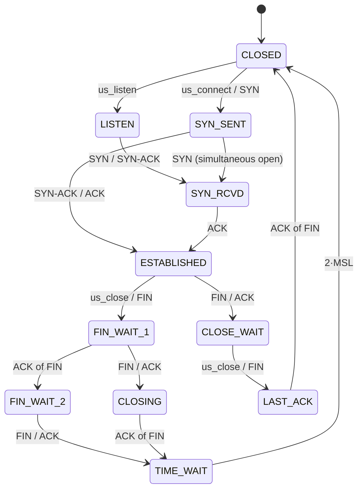

<p align="center"></p>

ustack is a TCP/IPv4 stack in C11. It runs in user space on a Linux TUN device.
Linux sends raw IP packets to ustack, and ustack does the rest: IPv4, ICMP, UDP, TCP and an HTTP/1.1 server.
Standard tools such as `curl`, `wrk`, `ping` and `nc` connect to it through the kernel, as they do to any other host.

The stack has approximately 4,200 lines of C and no dependencies other than libc.
The tests have approximately 1,800 more lines.

```console
$ curl http://10.0.0.2/
<!doctype html><title>ustack</title><h1>Hello from ustack</h1>...
```

## Results

All numbers come from Docker on an Apple-silicon Mac (Linux 6.12, arm64, 10 vCPU).
The peer is the **Linux kernel TCP stack**. The load generator uses the same vCPUs as ustack.
Each value is the **median of 5 runs** after one warm-up run. Each bulk transfer has a SHA-256 check.

| What | Result |
|---|---|
| HTTP/1.1 requests per second, 1,000 connections, 4 shards | **1.26 M** |
| HTTP/1.1 requests per second, 1 shard | **748 k** |
| Download on one core, MTU 1500 | **10.2 Gbit/s** |
| Upload on one core, MTU 1500 | **21.3 Gbit/s** |
| Download with TSO/GSO offload | **68.8 Gbit/s** (6.7×) |
| Request latency at 100 connections | **p50 118 µs · p99 328 µs** |
| New TCP connections per second (handshake, request, close) | **59.6 k** |
| Concurrent keep-alive connections | **10,000** at 716 k requests/s |
| Memory for each established HTTP connection | **10.4 KB** (2 KB stack, 8 KB app buffer) |
| Randomized simulations, invariants checked after each event | **100,000 passed, 0 failed** |
| Fuzzed inputs (libFuzzer with ASan and UBSan) | **1.6 M, 0 crashes** |
| Interop checks against Linux TCP | **31 / 31** |

**Under loss, ustack is faster than Linux at 1% and 10%.** The test downloads 100 MB with random loss in both
directions. Each transfer arrives intact.

| Loss in each direction | ustack | Linux kernel TCP | |
|---|---|---|---|
| 1% | **0.47 s** | 0.86 s | 1.8× faster |
| 5% | 15.7 s | 12.0 s | 31% slower |
| 10% | **149.5 s** | 170.2 s | 12% faster |

> [!NOTE]
> TUN is a memory copy, not a wire. The throughput numbers measure the software cost of each packet, not NIC line rate.
> The Linux baseline runs with TSO, GSO and GRO off, so `netem` drops 1500-byte packets for both stacks.
> Linux still wins at 5% loss. Its PRR (RFC 6937) keeps ACKs moving after a lost retransmission.
> PRR is the next feature to add. The full method is in [`bench/`](bench) and the raw data is in [`bench/results/`](bench/results).

## How it works

The eight figures below show each part of the stack.

### 1. The big picture



ustack opens the TUN device with `IFF_MULTI_QUEUE`. Each queue has its own file descriptor.
One thread reads each queue. We call this thread and its data a **shard**.

- The kernel hashes the 4-tuple of each flow to one queue.
- The kernel also learns which queue our replies come from. Thus, all packets of one connection go to one shard.
- Each shard has its own connection table, timer wheel, listeners and apps.
- The shards share no data. The data path has no locks and no atomic operations.

The protocol code does not call the operating system. The driver gives it three things:
a received packet (`stack_input`), the time (`stack_advance`), and a request to send output (`stack_flush`).
The same code runs against the real kernel, in a deterministic simulator, and under a fuzzer.

### 2. The life of a packet



1. The driver reads up to 256 packets in one batch.
2. IPv4 checks the version, the header length, the total length, the checksum and the address.
3. TCP checks the checksum with the pseudo-header. With offload on, the kernel already did this.
4. The lookup tries a one-entry cache first. Then it uses a hash table keyed with SipHash-2-4.
5. The state machine applies RFC 9293: PAWS, the window test, RST and SYN rules, ACK processing.
6. The payload goes into the receive ring one time, at its final position.
7. The app gets an `on_readable()` callback.

After the batch, `stack_flush()` sends **one** ACK for each connection that needs one.
The data path does not allocate memory on the heap.

### 3. One TCP connection



ustack has all 11 states of RFC 9293, which includes simultaneous open and simultaneous close.
It negotiates MSS, window scaling, timestamps and SACK.

- **TIME_WAIT** keeps the port for 2·MSL. A late duplicate segment cannot enter a new connection.
- **RFC 5961:** a RST or SYN that is in the window, but not exact, gets a challenge ACK. A blind attacker cannot reset the connection.
- **RFC 6528:** the initial sequence number is a 4 µs clock plus SipHash of the 4-tuple and a secret.

<details>
<summary>The full state machine</summary>



</details>

### 4. Reassembly without a queue



Many small stacks keep a list of out-of-order segments. ustack does not.
The receive buffer is a ring, and each byte has a fixed position in it.

- An out-of-order segment goes directly to its position in the ring.
- A small sorted set of intervals records which ranges are present. The SACK blocks come from this set.
- When the missing segment arrives, `rcv_nxt` moves over all the data that is now contiguous.
- The ring grows when it needs space and releases its memory when it is empty. Thus, an idle connection is small.

### 5. Loss recovery: RACK



Classic TCP waits for three duplicate ACKs. ustack uses **RACK** (RFC 8985) instead.
The sender keeps a record for each segment in flight, with its send time and its SACK state.

- A segment is lost when a segment sent later is delivered, and the first segment is older than RTT + reorder window.
- This rule also finds a **lost retransmission**. Counting duplicate ACKs cannot do this.
- Counters for SACKed bytes and lost bytes give the bytes in flight in O(1) time on each ACK.
- Congestion control is pluggable: CUBIC (RFC 9438) or NewReno with byte counting (RFC 5681, RFC 3465).

### 6. Loss recovery: the tail-loss probe



The last segment of a burst has no later segment, so RACK cannot see that it is lost.
A **tail-loss probe** (TLP) fires after 2·SRTT + 2 ms and makes the receiver send an ACK.

RFC 8985 recommends a probe with new data. A packet capture showed a problem with Linux receivers:
Linux can hold the ACK for in-order data for up to 200 ms. Thus, ustack resends the last segment instead.
Linux always sends an ACK for duplicate data at once. This change cut the 5% loss test from 27.0 s to 15.7 s.

### 7. Offload: fewer, bigger writes



The cost per packet is mostly the system call. With `IFF_VNET_HDR` and `TUNSETOFFLOAD`, each write can carry a
64 KB segment with a `virtio_net_hdr`. The kernel then cuts it into MTU-sized segments, as a real NIC does.

- On transmit, ustack puts the pseudo-header sum in the checksum field and sets `NEEDS_CSUM`.
- On receive, ustack accepts GRO super-segments and skips checksums that the kernel marks as correct.
- The TCP code does not change. The download speed increases from 10.2 to 68.8 Gbit/s.

### 8. How we know it works



Because the protocol code does not call the OS, two ustack instances can run in one process over a virtual link.
The link uses a seed. It can lose, duplicate, corrupt, delay and reorder packets, with rate limits and queue limits.
Each seed also selects random buffer sizes, TCP options, congestion control and transfer sizes.

After **each** event, the simulator checks the invariants of each connection:

- The send records cover `[snd_una, snd_nxt)` with no gaps.
- The SACKed, lost and retransmitted counters are equal to a full count.
- No record is both SACKed and lost.
- The out-of-order ranges are sorted, do not overlap, and are inside the buffer.

| Layer | Result |
|---|---|
| Unit and scenario tests | **33 / 33**. Includes RFC 1071, SipHash and NIST SHA-256 vectors, sequence wraparound, zero-window probes, simultaneous close, RFC 5961, PAWS and 10,000 connections |
| Deterministic simulation | **100,000 / 100,000** seeds. 72.7 GB echoed and verified across 80.2 M segments and 5.8 M retransmissions. About 2 minutes |
| AddressSanitizer + UBSan | Unit tests, 1,000 simulations, and the interop suite with a sanitized daemon. No errors |
| libFuzzer | **1.6 M** structured inputs in 30 minutes on 8 workers. 0 crashes, 0 timeouts, 0 invariant violations |
| Interop with Linux TCP | **31 / 31**. 1 GB transfers with SHA-256, offload, 4 shards, 1–10% loss, reorder + duplicate + corrupt |
| Wire format | `tshark` finds **0** bad checksums and 0 malformed frames in [`docs/ustack.pcap`](docs/ustack.pcap) |

### The bugs the tests found

Each of these bugs passed code review. A test layer found each one.

| Bug | Found by |
|---|---|
| A lost SYN retransmission left no timer, so the connection stopped | simulator |
| A retransmitted segment with a new ACK did not update the window, so the sender went past the right edge | simulator |
| A segment at a zero window was dropped with its ACK, so both sides waited forever | simulator |
| ACKs that covered a retransmission gave false RTT samples, and the RTO grew to tens of seconds (Karn) | simulator |
| Sender SWS avoidance held a small tail with no timer to release it | scenario test |
| Each connection allocated 2 MB at once; 10,000 connections reserved 20 GB | ASan |
| App state leaked at shutdown | LeakSanitizer |
| The HTTP parser kept pointers into a buffer that it then moved | interop under `netem reorder` |
| The 500-packet tun queue overflowed at 1,000 connections | interop, `ip -s link` |
| Tail probes with new data waited for the receiver's delayed ACK | benchmark against Linux, then `tcpdump` |

The details of each bug are in [docs/ARCHITECTURE.md §7](docs/ARCHITECTURE.md#7-bugs-the-tests-found).

## Run it

Everything runs in Docker. The container needs `NET_ADMIN` and `/dev/net/tun` only. It does not need `--privileged`.

1. Build the image:

   ```bash
   docker build -t ustack-dev docker/
   ```

2. Build ustack and run the interop tests against the Linux kernel:

   ```bash
   ./scripts/docker.sh 'make -j BUILD=build-linux && ./tests/integration/run.sh'
   ```

3. Run the benchmarks:

   ```bash
   ./scripts/docker.sh 'make -j BUILD=build-linux && ./bench/run.sh'
   ```

The protocol code is portable. The unit tests and the simulator also run on macOS:

```bash
make && ./build/test_unit && ./build/sim --seeds 2000
```

Useful daemon options: `--shards N`, `--offload`, `--cc cubic|newreno`, `--drop-tx P`, `--no-sack`, `--rto-min MS`.
To replay one simulation with a full connection dump, use `./build/sim --seed N`. Set `SIM_TRACE=1` to print each packet.

## Repository map

```
src/core     checksum, ring, interval set, timer wheel, SipHash, SHA-256   (no I/O)
src/net      IPv4 (stack.c), ICMP, UDP
src/tcp      connection table and API, input, output, recovery, congestion control
src/apps     HTTP/1.1, echo, discard, UDP echo
src/netif    Linux TUN driver: multi-queue and virtio_net_hdr offload
tests        unit, sim (deterministic network), fuzz, integration
bench        benchmark harness and the Linux baseline
docs         architecture, planning record, figures
```

## Limits

- IPv4 only. IP fragments are counted and dropped, because TCP sets DF and negotiates the MSS.
- No ARP and no Ethernet, because TUN is a layer-3 device.
- No ECN, TCP Fast Open, pacing, PRR or SYN cookies.
- The Docker Desktop kernel has no `ifb`. Thus, the driver injects the loss in the stack-to-kernel direction (`--drop-tx`).
  The kernel-to-stack direction uses `netem`.

## More

- [docs/ARCHITECTURE.md](docs/ARCHITECTURE.md): the design in detail, the data structures and the full bug list.
- [docs/PLAN.md](docs/PLAN.md): the planning record. It has three plans, the critique of each, and what changed during the build.
