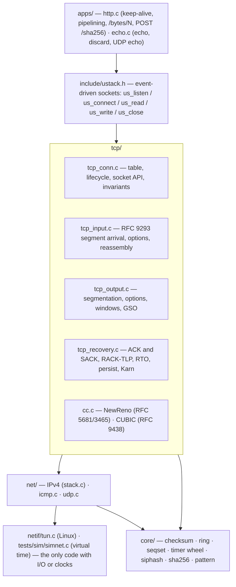
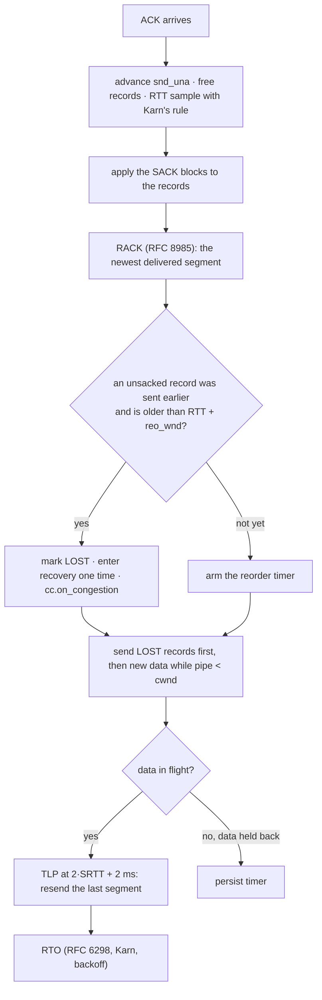

# ustack architecture

This document describes the design of ustack in detail. The [README](../README.md) gives the short version with
animated figures.

ustack is a TCP/IPv4 stack in C11. It runs in user space on a Linux TUN device.
Linux sends raw IP packets to ustack. ustack processes IPv4, ICMP, UDP and TCP, and it runs an HTTP/1.1 server.
The code has no dependencies other than libc.

## 1. The system

ustack opens the TUN device with `IFF_MULTI_QUEUE`. Each queue has its own file descriptor.
One thread, pinned to one CPU core, reads each queue. This thread and its data are a **shard**.

Each shard owns these items:

- one TUN queue
- one `us_stack`: the connection table, the timer wheel, the listeners and the statistics
- one copy of each app

The kernel selects a queue with a symmetric hash of the 4-tuple. The kernel also records the queue that our replies
use. Thus, all packets of one connection go to the same shard. The shards share no data.
The data path has no locks and no atomic operations.

## 2. Layers and files

The protocol code does not call the operating system and does not read a clock. Three functions drive it:

| Function | When the driver calls it |
|---|---|
| `stack_input(st, pkt, len, csum_ok)` | A packet arrives. |
| `stack_flush(st)` | The driver finishes a receive batch. The stack sends the coalesced ACKs and the data. |
| `stack_advance(st, now_ns)` | Time moves. The stack runs the expired timers, then it flushes. |

The output goes through the callback `netif->tx`. Because the driver supplies the time and the I/O, the same code
runs in three places: against the real kernel (`src/main.c`), against a second ustack in a deterministic simulator
(`tests/sim`), and under libFuzzer.

## 3. The receive path

1. The driver calls `readv()` to get the `virtio_net_hdr` and the IPv4 packet.
2. IPv4 checks the version, the header length, the total length, the header checksum, the address and the fragment bits.
3. TCP checks the checksum with the pseudo-header. If the kernel sets `NEEDS_CSUM` or `DATA_VALID`, TCP skips this step.
4. The lookup tries a one-entry cache. Then it searches a hash table keyed with SipHash-2-4.
5. The state machine does these steps in order: PAWS, the acceptability test, trim, RST and SYN (RFC 5961), ACK, data, FIN.
6. The payload goes into the receive ring one time, at its final position.
7. The stack calls `on_readable` or `on_writable` in the app.

The driver repeats steps 1 to 7 until `EAGAIN` or 256 packets. Then it calls `stack_advance()`.
This call runs the timers and then the flush. The flush sends the retransmissions, the new data and one ACK for each
connection that needs one.

The data path does not allocate memory on the heap. The stack allocates memory only when it opens a connection or
when a buffer grows.

## 4. Data structures

| Structure | Design | Reason |
|---|---|---|
| `struct ring` | A logical capacity that is a power of two, and a physical allocation that grows when necessary and is released when empty. | The logical capacity sets the window. The physical size follows the data. An idle connection uses approximately 2 KB of stack memory. |
| Send ring | The head is the oldest unacknowledged byte. | A retransmission reads directly from the ring by sequence offset. There is no queue of segment copies. |
| Receive ring | An out-of-order segment goes to `len + (seq − rcv_nxt)`. | Reassembly needs no list. To fill a hole, the stack moves `rcv_nxt`. |
| `struct seqset` | A sorted set of intervals in sequence space, with no overlaps. | It records the out-of-order ranges. The SACK blocks come from it, with the newest block first (RFC 2018). |
| `struct txq` | A ring of `{seq, len, xmit_ns, flags}`, one entry for each transmitted segment. | It is the SACK scoreboard and holds the RACK send times. `pipe = flight − sacked − lost`, with O(1) counters. |
| Timer wheel | 4096 slots of 1 ms, with intrusive doubly linked nodes (Varghese and Lauck). | Arm and cancel are O(1) for RTO, TLP, RACK reorder, persist, delayed ACK and TIME_WAIT. |
| Connection table | A chained hash table keyed with SipHash-2-4 and a secret for each stack. It grows when the load factor is 1. | A remote host cannot flood one bucket. Bulk flows hit the one-entry cache. |
| Initial sequence number | `M(4 µs clock) + SipHash(4-tuple, secret)` | RFC 6528. |

## 5. TCP

**States.** ustack has all 11 states of RFC 9293. This includes simultaneous open and simultaneous close.
The active closer stays in TIME_WAIT for 2·MSL. A FIN_WAIT_2 connection without an app has a time limit.

**Options.** The SYN and the SYN-ACK negotiate MSS, window scaling, timestamps and SACK.
While out-of-order data is present, each ACK carries SACK blocks. PAWS rejects segments with old timestamps.

**Attacks.** RFC 5961 is in use. A RST that is in the window, but not exact, gets a challenge ACK.
A SYN in a synchronized state also gets a challenge ACK. An ACK for data that was not sent gets an ACK and is dropped.

**Windows.**

- The receiver avoids silly windows. The right edge moves by at least min(cap/2, MSS), and it never moves back.
- The sender avoids silly windows too. Nagle is optional.
- The persist timer probes a zero window. It also releases data that the sender holds back for SWS reasons.
- The window update follows Linux `tcp_may_update_window`. Section 7 explains why.

**Loss recovery.**

If the peer does not support SACK, the stack uses three duplicate ACKs and NewReno partial ACKs (RFC 6582).

**The tail-loss probe.** This is a deliberate change from RFC 8985 §7.3.

RFC 8985 recommends a probe with new data when new data is available. A packet capture against Linux showed a problem.
The Linux receiver can hold the ACK for in-order data for up to `TCP_DELACK_MAX` (200 ms), when an ACK would shrink
its window. Thus, a probe with new data gets no fast ACK, and the sender waits for the 200 ms RTO.
A copy of the last segment is duplicate data. Linux sends an ACK with a D-SACK for duplicate data at once.
With this change, the 100 MB transfer at 5% loss takes 15.7 s, not 27 s. At 1% loss, it takes 0.47 s, not 1.06 s.

**Congestion control.** The `cc_ops` interface is pluggable. There are two implementations:

- NewReno with appropriate byte counting.
- CUBIC with fast convergence and the Reno-friendly region.

Both increase the window only when the connection is limited by `cwnd`. The initial window is IW10 (RFC 6928).

**Offload.**

With `--offload`, the TUN device uses `IFF_VNET_HDR` and `TUNSETOFFLOAD(TUN_F_CSUM | TUN_F_TSO4)`.

- The stack accepts GRO super-segments. It trusts `NEEDS_CSUM` and `DATA_VALID`.
- The stack sends TSO segments of up to 64 KB with a partial checksum: the pseudo-header sum goes in the checksum field.
- The kernel processes these as GSO packets, as it does for a virtio NIC.

## 6. Verification

| Layer | What it proves | Location |
|---|---|---|
| Unit tests (33) | RFC 1071 and RFC 1624 checksums against a reference. SipHash and NIST SHA-256 vectors. Rings, interval sets, timers, option parsing. TCP and HTTP scenarios: option negotiation and fallback, refused connect, **sequence wraparound**, zero-window persist, simultaneous close, RFC 5961, PAWS, bad checksums, 10,000 connections, HTTP framing. | `tests/unit` |
| Deterministic simulation | Two stacks over a seeded link with loss, duplication, bit corruption, jitter, rate limits and tail-drop queues. Each seed selects random buffers, options, congestion control and sizes. A bidirectional echo is verified byte by byte. The invariants are checked after **each** event. | `tests/sim` |
| libFuzzer + ASan/UBSan | A live connection gets fuzzer-selected raw packets, valid but hostile segments, app calls and time jumps. The invariants are checked after each operation. | `tests/fuzz` |
| Interop | 31 checks against Linux TCP: ping, UDP, RST, HTTP, 1 GB transfers with SHA-256, offload, 4 shards, 1–10% loss in both directions, reorder + duplicate + corrupt, and a `tshark` checksum audit. | `tests/integration` |

`tcp_check_invariants` checks these conditions after each simulated event:

- The records cover `[snd_una, snd_nxt)` with no gaps.
- The counters `sacked`, `lost` and `retrans_out` are equal to a full count.
- No record is both SACKed and lost.
- The out-of-order ranges are sorted, do not overlap, are above `rcv_nxt`, and are inside the buffer.
- The rings never overflow.

## 7. Bugs the tests found

Each of these bugs passed code review. A test layer found each one. None of them shows in a `curl` smoke test.

| Bug | Found by | Fix |
|---|---|---|
| A lost SYN retransmission left no timer, so the connection stopped. | Simulator (liveness) | `tcp_output` arms the retransmit timer again in the SYN states. |
| A retransmitted segment had a new ACK but an old sequence number. `snd_una` moved, but the window did not change. Thus, the sender went past the right edge of the receiver. | Simulator (the dump showed data past `rcv_adv`) | Use the Linux rule `tcp_may_update_window`: an ACK that moves `snd_una` always updates the window. |
| At a zero window, a segment was dropped together with its ACK. RFC 9293 says to process the ACK. Both sides waited forever. | Simulator | The acceptability test includes the right edge. A pure ACK uses `min(snd_nxt, snd_una + snd_wnd)` as its sequence number. |
| A cumulative ACK that covered a retransmitted hole gave a false RTT sample. The RTO grew to tens of seconds. | Simulator (20% loss without SACK) | Karn's rule: no RTT sample from sequence numbers when the ACK covers retransmitted data (as Linux `FLAG_RETRANS_DATA_ACKED`). |
| Sender SWS avoidance held a small tail with nothing in flight and no timer. The connection stopped. | Scenario test | The persist timer also starts when the sender holds data back (the RFC 9293 §3.8.6.2.1 override). |
| Each connection allocated a 1 MiB ring for send and for receive. 10,000 connections reserved 20 GB. | ASan run of the 10,000-connection test | The rings grow when necessary and release their memory when empty. |
| The app state of each connection leaked at shutdown. | LeakSanitizer during interop | Shutdown calls `on_close` for each app. |
| The HTTP parser kept pointers into a buffer and then moved the buffer. The bug occurred only when reordering put the headers and the body into one read. | Interop under `netem reorder` | The request keeps its own copies. Three regression tests. |
| The 500-packet tun0 queue overflowed at 1,000 connections (16,000 drops). | Interop, `ip -s link` | `--txqlen`, default 4096. This is the TUN version of a larger NIC receive ring. |
| ustack was 2.2× slower than Linux at 5% loss. The RTO logs and a packet capture showed that the receiver's delayed ACK held the tail probes. | Benchmark against the Linux baseline | The TLP resends the last segment, which makes Linux send a D-SACK at once. The PTO minimum is 2 ms, as Linux `TCP_TIMEOUT_MIN`. |

## 8. Limits

- IPv4 only. IP fragments are counted and dropped, because TCP sets DF and negotiates the MSS.
- No ARP and no Ethernet, because TUN is a layer-3 device.
- No ECN, TCP Fast Open, pacing, PRR or SYN cookies.
- The stack marks a record as SACKed only when a SACK block covers all of it. This is a safe choice: the stack can
  send bytes again that the receiver has, but it never skips bytes that the receiver does not have.
- The Docker Desktop kernel has no `ifb`. Thus, the driver injects the loss in the stack-to-kernel direction
  (`--drop-tx`). The kernel-to-stack direction uses real `netem`.
